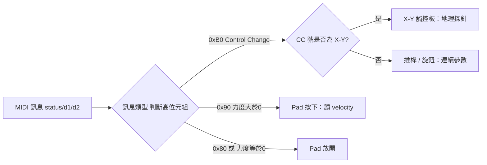
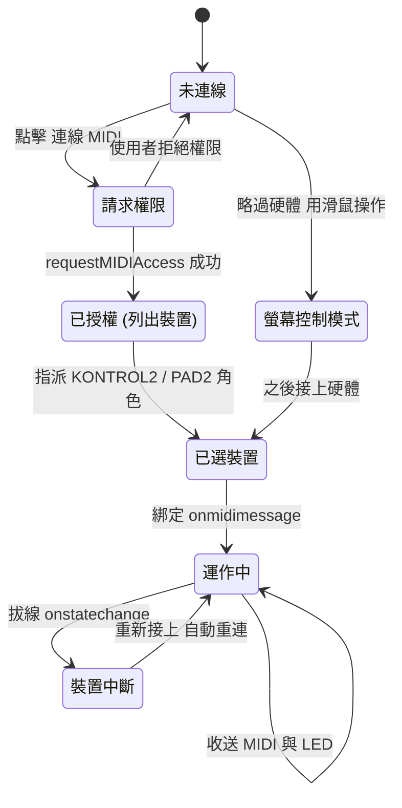
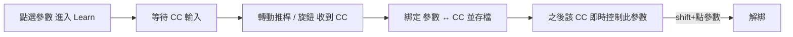
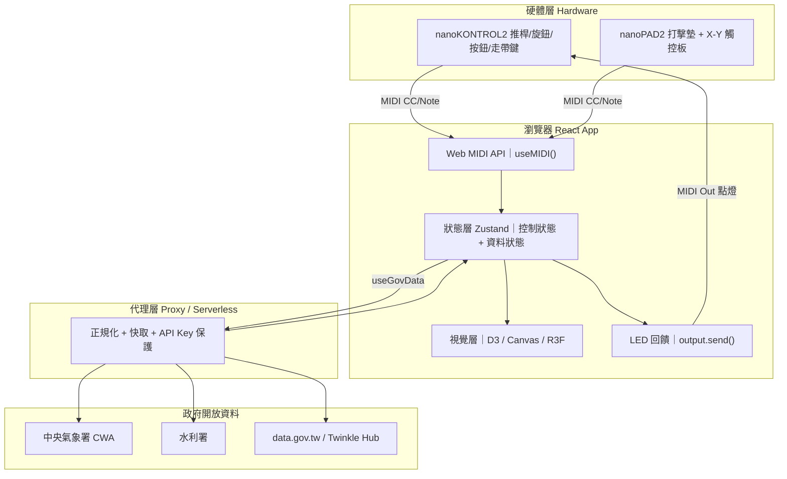
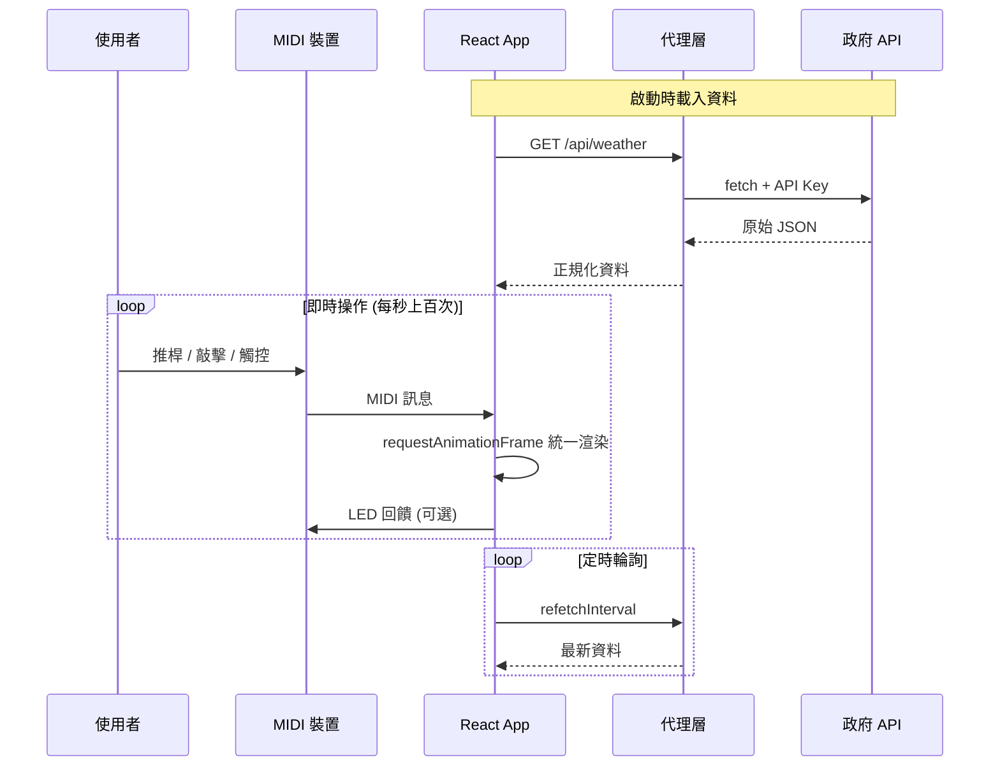
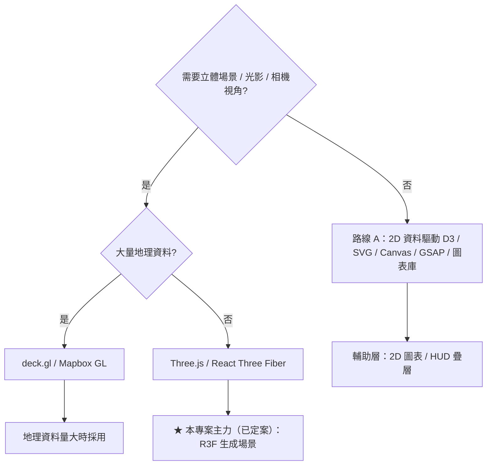
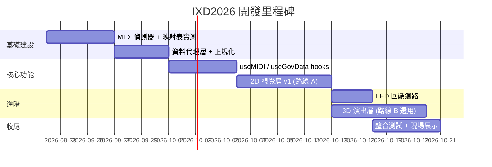

# IXD2026 — MIDI 實體控制器 × 政府開放資料互動系統｜規格文件

| 項目 | 內容 |
|---|---|
| 專案代號 | IXD2026 |
| 文件版本 | v0.3 |
| 最後更新 | 2026-09-21 |
| 技術主軸 | React.js · Web MIDI API · 政府開放資料 (Twinkle Hub / CWA / 水利署) |
| 硬體 | KORG nanoKONTROL2、KORG nanoPAD2 |

> 本文件所有 Mermaid 圖皆為標準語法，可直接在 GitHub / VS Code Markdown Preview / Mermaid Live Editor 獨立渲染。

---

## 1. 專案概述 (Overview)

本專案以 **KORG nanoKONTROL2 + nanoPAD2 兩台 MIDI 控制器**作為實體輸入，透過瀏覽器原生 **Web MIDI API** 即時操作以 **React.js** 建構的網頁介面，內容資料來源為 **台灣政府開放資料**（透過 [Twinkle Hub](https://hub.twinkleai.tw/zh-TW) 及各部會開放平台）。

核心命題：**把抽象的多維資料，變成一台可以用雙手「演奏」的資料樂器**。實體控制器最強的能力是「同時多路、連續、盲操作」；政府開放資料的價值是「多維、有時間、有空間」。兩者交集即為本專案的設計核心。

### 1.1 設計目標
- 證明「實體控制器 vs 滑鼠鍵盤」在資料探索上的體驗差異。
- 建立可重用的 `useMIDI` / `useGovData` React 架構。
- 完成一個可現場操作展示的資料視覺化「儀表台 / 演出台」。

---

## 2. 需求規格 (Requirements)

### 2.1 功能性需求 (Functional Requirements)

| 編號 | 需求 | 優先級 |
|---|---|---|
| FR-01 | 系統能連線並辨識 nanoKONTROL2 與 nanoPAD2 兩台裝置 | P0 |
| FR-02 | 推桿 / 旋鈕（CC）即時連續控制視覺參數 | P0 |
| FR-03 | 打擊墊（Note）觸發事件，並讀取 velocity 力度 | P0 |
| FR-04 | X-Y 觸控板作為 2D 地理探針，查詢對應測站資料 | P1 |
| FR-05 | 走帶鍵（Transport）播放 / 捲動時間序列資料 | P1 |
| FR-06 | 由政府開放資料 API 取得即時資料並依頻率輪詢更新 | P0 |
| FR-07 | 螢幕即時鏡像控制器狀態（解決實體/畫面跳值） | P1 |
| FR-08 | 反向送 MIDI 點亮 nanoKONTROL2 的 LED 作為狀態回饋 | P2 |
| FR-09 | 支援裝置熱插拔（中途拔線/接線自動重連） | P2 |
| FR-10 | 版面採左右分欄（左：視覺主畫面；右：UI 控制面板） | P0 |
| FR-11 | 裝置選擇：列出偵測到的 MIDI 輸入，指派 KONTROL2 / PAD2 角色 | P0 |
| FR-12 | 連線狀態指示 + 手動「連線 MIDI」觸發 Web MIDI 權限 | P0 |
| FR-13 | 無硬體降級：右側控制項可用滑鼠操作（螢幕控制 / demo 模式） | P1 |
| FR-14 | 參數以 MIDI Learn 動態綁定 CC（可解綁、存檔），非寫死映射 | P0 |
| FR-15 | 時間軸場景 keyframe 自動演化參數 + 手動覆寫（soft-takeover） | P1 |
| FR-16 | 主畫面採 3D 生成場景（Three.js / R3F），由參數即時驅動 | P0 |
| FR-17 | nanoPAD2 打擊墊 → 資料事件（velocity=強度）；X-Y → 探針 / 鏡頭 | P1 |
| FR-18 | 資料導覽：依序巡演八站真實資料（含空氣品質）並以字幕說明；導覽員可點進度點跳站、上一站 / 下一站 / 暫停（`←` `→` `P`）、複製每站連結（`?tourstop=`），並可選用語音旁白（iOS 需手勢內解鎖，見 FR-24）。空氣品質站一律播「字幕描述的模型序列」，即使有環境部觀測 | P1 |
| FR-19 | 裝置診斷頁（`?diagnostics=1`）：25 項快速檢查 + 15 項互動檢查（含語音旁白、看門狗自我檢查、相機手勢），展前逐項確認實際硬體並匯出報告；不上傳任何東西 | P1 |
| FR-20 | 「空氣品質」海況：有變化的空品資料（Open-Meteo / CAMS 模型資料），介面一律標示「模型資料、非政府觀測」；資料卡與資料看板附 120 小時迷你折線圖 | P1 |
| FR-21 | 首次進站的一步一步互動新手導覽（取代長篇說明）；輸入輸出（系統事件）監看可隱藏（`L` / Footer 開關 / `?log=`） | P2 |
| FR-22 | 視角依畫布長寬比自動取景，手機直式全螢幕看得到整顆球；寬螢幕取景不變（`?fit=0` 可關）。第 5 輪起有「完整（含光暈，預設）/ 填滿（球殼填滿寬度）」兩種取景（「裝置 → 取景」或 `?fit=full` / `?fit=fill`），手機直式時測站星座避開頂端資料列 | P2 |
| FR-23 | 導覽員手機遙控：「多人」視窗切到「導覽員」分頁（或演出 / 展場模式按 `G` 顯示 60 秒）出現帶 guide token 的 QR；手機掃碼後可上一站 / 下一站 / 暫停·繼續 / 開始 / 結束 / 站別跳轉 / 切換念出字幕，並看到站名、備註、這一站的剩餘時間與下一站預告（主畫面正在錄製 / 播放時「開始導覽」停用並說明原因；暫停·繼續鈕不設 `aria-pressed`）；只能操控導覽、不能演奏；鎖屏 / 切背景後自動重連（1、2、4、8、15 秒退避），連線期間要求螢幕保持喚醒 | P1 |
| FR-24 | 語音與手勢換站：導覽進行中說「下一站」「上一站」「暫停導覽」「繼續導覽」「結束導覽」（「開始導覽」隨時可用）、或對相機張開手掌橫掃（向左＝下一站、向右＝上一站），皆不中止導覽；「揮手換站」開關預設開並記住選擇；偵測量測有效幀間隔並讓時間類門檻隨之放寬（幀間隔 ≤ 100 ms 的裝置行為不變、慢推論裝置也能連續揮手；門檻仍是合成資料調的、未經真機驗證）；導覽中張手不讓海面平靜；旁白以「打開開關那一下同步念一句」與「第一次觸碰無聲解鎖」處理 iOS | P2 |
| FR-25 | 導覽腳本：導覽員自訂要講的站、順序與每站備註（≤ 120 字，原文不翻譯），最多存 5 份於瀏覽器，以 `?tour=<站 id 清單>`（另有 `?tourplan=` `?tournotes=` `?tourname=`）分享；網址腳本不自動開始導覽；`?tour=0/1/on/off` 仍是閒置自動導覽開關；焦點在腳本編輯器文字欄位且 2 分鐘內有輸入時，閒置自動導覽延後；有備註的站旁白最長等待延長為 6 秒 + 備註預估朗讀時間（加成上限 25 秒） | P2 |
| FR-26 | 診斷導引與裝置備註：`?diagnostics=1&guided=1`（或頁首「依序帶我做完互動檢查」）先跑完快速檢查，再一次一項帶做完互動檢查並給總結；選填「裝置備註」（型號 / 系統 / 瀏覽器 / 測試人 / 備註）只在使用者按複製 / 下載時進報告，「帶入偵測值」只補空白欄位；頁首提示與報告內的隱私聲明是同一句「不含 IP、影像或音訊；Web MIDI 埠名稱、手把型號字串與裝置備註會照實列出，貼出前請先檢查」（不宣稱「不含個人資料」） | P1 |
| FR-27 | 環境部觀測並列（選用）：使用者自備 `MOENV_KEY`（CI Secret）時，管線抓離模型格點最近（25 公里內；優先選目前 PM2.5 有效的站）的環境部測站逐時 PM2.5 存入 `air.obs`（最新有效 PM2.5 小時超過 12 小時視為過期、不採用）；資料卡「模型 vs 觀測」比較卡（兩條折線 + 描述性結論 + 出處授權 + 距離但書）、「驅動海況的資料」切換（有觀測預設用觀測；驅動來源為觀測時，靜態海況也用觀測最新 PM2.5，與看板「映射」列一致；只存在記憶體，資料更新不洗掉它）、資料看板「觀測 / 落差 / 驅動」列；**沒有金鑰時完全不影響現況** | P2 |
| FR-28 | 揚塵的模型風速補洞：`air.history` 帶 Open-Meteo 逐時模型風速 / 風向；水利署風速無效或凍結時，揚塵歷史改用模型風速驅動，並在資料卡、看板、HUD 與字幕明講「模型資料」 | P2 |

### 2.2 非功能性需求 (Non-Functional Requirements)

| 編號 | 需求 | 指標 |
|---|---|---|
| NFR-01 | 互動延遲 | MIDI 輸入到畫面反應 < 50ms |
| NFR-02 | 畫面流暢度 | 維持 60 FPS（大量元素時容許 30 FPS） |
| NFR-03 | 瀏覽器支援 | Chrome / Edge（主要）；Firefox / Safari 16.4+（次要） |
| NFR-04 | 安全性 | API Key 不得出現在前端；需 HTTPS 或 localhost |
| NFR-05 | 資料時效 | 輪詢頻率對齊資料源真實更新頻率，不過度請求 |
| NFR-06 | 展場穩定性（整天不關機、無人看管） | 畫面錯誤自動倒數重載（退避 5 → 15 → 60 秒，10 分鐘內 5 次熔斷停手，**停手後半開復原**：約 10 分 30 秒後自動再試一次，永久壞掉的版本任何 12.5 分鐘視窗內最多 6 次重載）；WebGL 遺失 4 秒未恢復即重載；渲染看門狗（可見卻 10 秒無動畫幀；展場與觀眾視窗預設啟用）；新版（`dist/version.json`）與新資料只在閒置時自動更新；`?reload=HH` 每日重載；崩潰紀錄只存本機；手機遙控器 3 分鐘內有操作訊息就算有人在（延後重載與資料更新，不看連線數）；畫面右下角 8px 維運指示燈（綠圓 / 琥珀環 / 紅三角 / 灰虛線圓，`?kiosk` 預設顯示，`?oplight=1/0`） |
| NFR-07 | 資料誠實與標示 | 模型資料一律標示、不冒充政府觀測；環境部觀測一律標「環境部觀測」並附授權（政府資料開放授權條款－第1版），與模型序列分開標示、互不混用字樣；模型與測站的比較只是描述性統計並附距離 / 網格但書；CC BY 4.0 的 Open-Meteo 標示出處；沒驗證過的事如實揭露（見 README〈驗證狀態〉） |
| NFR-08 | 可驗證性 | 純邏輯以 `node --test` 驗證（撰寫本文時 1705 項：1703 通過、2 跳過；跳過的是需設環境變數才跑的 2 項 dist 驗證），瀏覽器 / 真機專屬行為以裝置診斷頁（含導引模式）與真機驗證日補足（見 README〈測試〉〈裝置診斷頁〉） |
| NFR-09 | 導覽員遙控的安全 | 導覽員權限只有「操控資料導覽」，不能演奏或改設定；guide token 為 10 碼 `crypto.getRandomValues` 隨機英數（無安全亂數來源則停用整個導覽員功能，不退回 `Math.random`），只存記憶體、只在該次開啟的主畫面（host session）有效，主畫面重載或換 ID 後失效；連線先送 `hello` 由 host 驗證，token 不符維持一般遙控，同一連線失敗 5 次關閉；一般連線送來的導覽員指令一律忽略；導覽員指令只呼叫 `touchGuide()`，不中止導覽。**已知風險**：QR 被拍照外流者在該 session 存活期間可操控導覽（只有導覽），無全域失敗次數限制、也不是一次性配對碼 |
| NFR-10 | 入口檔預算與英文字典動態載入 | 入口 chunk gzip ≤ 40 kB（目前 minified 36.3 kB、gzip 14.3 kB；原為 144.0 kB、gzip 67.4 kB）；英文字典彙整為單一帶 hash 的 `i18n-en` chunk（約 110.0 kB、gzip 54.6 kB），只被動態 import，不在首載關鍵路徑上：手機遙控頁的中文模式完全不下載，主畫面 / 觀眾視窗的中文使用者在畫面出來後、閒置時預抓（省流量模式、離線、已載入時略過；診斷頁不預抓），按 EN 才不依賴當下的網路、離線的 PWA 也切得過去（預抓只在單元測試驗證）；按 EN 時語言鈕有忙碌狀態，載入失敗顯示約 6 秒的雙語提示，硬失敗後再按 EN 會存好偏好、把網址的 `?lang=` 改成 `en` 並整頁重新載入；英文啟動在第一次 render 前等字典（最多 8 秒，逾時先以中文 render）；Node 測試維持同步。**沒有自動化測試強制這個 gzip 數字**（測試只驗證分塊結構），英文使用者首載多一趟往返 |
| NFR-11 | 環境部金鑰與資料管線 | 金鑰只從環境變數 `MOENV_KEY`（CI 為 GitHub Actions Secret）讀取，沒設定（含空字串 / 空白）時整段略過、不算失敗；金鑰不進程式、日誌或 `ocean.json`（日誌與例外一律遮蔽 `api_key`）；抓取失敗或新抓到的最新有效 PM2.5 小時超過 12 小時（stale）時保留舊觀測（fetchedAt 與它自己最新的有效 PM2.5 小時都 ≤ 48 小時，更舊移除）且不影響其他資料集；管線只用「真實欄位格式的合成 fixture」驗證，**未用真實金鑰驗證**，第一次有金鑰時要看 CI 日誌（`moenv station`、`air obs refreshed`；失敗為 `moenv obs failed`） |

---

## 3. 資料規格 (Data)

### 3.1 資料來源與結構（實測欄位）

| 資料集 | 來源 | 真實結構 | 更新頻率 | 適合的控制 |
|---|---|---|---|---|
| 36 小時縣市預報 | CWA F-C0032-001 | 22 縣市 × {Wx 天氣碼, PoP 降雨機率%, MinT/MaxT 溫度, CI 舒適度} × 3 時段 | 6 小時 | 推桿/Pad = 縣市；Transport = 時段 |
| 即時自動氣象站 | CWA O-A0001-001 | ~700 站 × {經緯度 WGS84, 氣溫, 濕度, 風速/風向, 雨量, 氣壓} | 10 分鐘 | X-Y 觸控板 = 地理座標探針 |
| 水庫即時水情 | 水利署 45501 | 逐小時 time-series × {水位, 有效蓄水量, 進流量, 出流量} | 1 小時 | Transport 播放鍵 = 時間軸捲動 |
| IoW 揚塵 | 水利署 `ae7bd821-a879-4b65-ad34-b3dac36874e0`（+ 基本資料 `a2ea1f32-…`） | 雲林縣 3 站 × {PM10, 風速, 氣溫, 相對濕度} **最新值**（PM10 常為哨兵值 4999.4 → 視為缺值） | 約 1 小時（歷史由 CI 每 3 小時累積） | 海水清澈 / 垃圾 / 洋流；Transport = 歷史播放（PM10 無效時用風速） |
| 河川流量測站站況 | 水利署 `9332bd66-0213-4380-a5d5-a43e7be49255` | 188 站 × {河川, TWD97 座標, 集水面積, 現存 / 已廢}，僅站點目錄 | 靜態 | 背景星座 |
| 魚類調查 | 水利署 `0a79fde0-a69d-4842-b66b-e51f43ce83f0` | 樣點 × 物種 × 日期 × 數量 → 逐月 / 逐年物種數 | 靜態（歷史調查） | 魚群數量；Transport = 調查年表 |
| 月出月沒時刻 | CWA A-B0063-001 | 縣市 × 逐日 {月出 / 中天 / 月沒時刻、月出月沒方位角、中天仰角}（單次最多 180 天，需帶 `timeFrom` / `timeTo`） | 每日 | 月亮方位 / 高度；Transport = 逐日播放 |
| 空氣品質（**模型資料，非政府觀測值**） | Open-Meteo Air Quality API（CAMS 全球大氣模型；CC BY 4.0） | 雲林縣麥寮（約 23.79°N、120.25°E）× 逐時 {PM2.5、PM10、沙塵、US AQI}；每次抓過去 5 天，保留「現在以前」最近 120 小時；另帶逐時模型風速 / 風向（`wind`、`windDir`，獨立請求，失敗只保留舊值）；US AQI 是美國 EPA 指標，不是環境部 AQI | 逐時（CI 每 3 小時刷新，失敗保留舊資料） | 海水清澈 / 垃圾 / 色相 / 輝光；Transport = 逐時播放；模型風速補揚塵的洞 |
| 空氣品質測站觀測（**選用，需使用者自備 API 金鑰**） | 環境部資料開放平台（目前值 `aqx_p_432` + 歷史 `aqx_p_488`；政府資料開放授權條款－第1版） | 離模型格點最近（25 公里內；優先選目前 PM2.5 有效的站）的測站 × 逐時 {PM2.5、PM10、AQI（環境部）、風速}，整點對齊、最近 120 小時；最新有效 PM2.5 小時超過 12 小時不採用；欄位格式依環境部公開說明，**管線只用合成 fixture 驗證、未用真實金鑰驗證** | 逐時（CI 每 3 小時刷新；沒有金鑰、抓取失敗或資料過期時略過 / 保留 ≤ 48 小時的舊觀測） | 「模型 vs 觀測」比較卡；「驅動海況的資料」；Transport = 逐時播放 |

> 實作備註：實際採「靜態快照 `public/data/ocean.json` + GitHub Actions 定時刷新」而非代理層（見 README〈資料集 → 畫面〉），因此瀏覽器不需直連政府 API，CORS 與金鑰外洩問題不存在。
>
> 空氣品質備註：水利署 IoW 揚塵的 PM10 感測器仍回傳無效哨兵值、風速疑似凍結（截至 2026-09-20），所以另加有變化的空品資料，而水利署風速凍結時揚塵改用 Open-Meteo 的逐時模型風速補洞（標示為模型資料）。環境部空品 API 需要使用者自己申請的 API 金鑰，本專案沒有代為申請；管線**已實作**，只從環境變數 `MOENV_KEY` 讀取（CI 為 GitHub Actions Secret），**沒有設定時完全略過、不影響現況**；設定步驟見 README〈資料 / 授權〉（環境部資料開放平台 <https://data.moenv.gov.tw/> 取得金鑰 → repo Settings → Secrets and variables → Actions 新增 `MOENV_KEY` → 手動執行 refresh-data 看日誌）。有金鑰時，「空氣品質」可並列環境部測站觀測與模型；模型格點是數十公里的粗網格、測站是一個點，兩者的比較只是描述性統計；管線尚未以真實金鑰驗證。在使用者設好金鑰之前，空氣品質一律當作模型資料看待。

- 授權：政府資料開放授權條款第 1 版 (OGDL v1) + 各平台使用規範（環境部觀測同為政府資料開放授權條款－第1版）。空氣品質的模型資料來自 Open-Meteo，授權 CC BY 4.0，需標示「Weather data by Open-Meteo.com」並連結 <https://open-meteo.com/>；其免費 API 限非商業使用。
- 資料另可透過 Twinkle Hub 跨 28 domain、53,000+ dataset 擴充（不動產、採購、交通、環境、醫療…）。

### 3.2 資料正規化原則
- 所有 0–127 的 MIDI 值統一正規化為 `0.0–1.0` 再對應到資料範圍。
- API 回傳的字串數值一律 `parseFloat` 轉數字，`-99` 等哨兵值視為缺值。
- 代理層統一輸出扁平化 JSON，前端不處理各 API 的巢狀差異。

### 3.3 資料取得的關鍵風險（務必先解決）
- **CORS**：多數政府 API 不允許瀏覽器跨域直接請求 → 需經由代理層。
- **API Key**：CWA 開放平台需免費註冊授權碼，**不可寫死在前端** → 放代理層環境變數。
- **Twinkle Hub REST 可用性**：需先確認是否提供可供瀏覽器直接呼叫（CORS 開放）的公開 REST API；若否，一律走自建代理層。

---

## 4. 硬體規格 (Hardware)

### 4.1 裝置能力

| 裝置 | 控制元件 | 訊息類型 | 值域 | 特性 |
|---|---|---|---|---|
| nanoKONTROL2 | 推桿 ×8 | Control Change | 0–127 | 絕對值、多路並行 |
| nanoKONTROL2 | 旋鈕 ×8 | Control Change | 0–127 | 絕對值 |
| nanoKONTROL2 | S/M/R 按鈕 ×24 | CC（可設 Note） | 0 / 127 | 開關、LED 可回控 |
| nanoKONTROL2 | 走帶鍵 ×13 | CC | 0 / 127 | 播放/停止/上下頁 |
| nanoPAD2 | 打擊墊 ×16（×4 Scene） | Note On/Off | velocity 0–127 | **力度感應** |
| nanoPAD2 | X-Y 觸控板 ×1 | CC（X 軸 + Y 軸） | 各 0–127 | **2D 連續手勢** |

### 4.2 預設 MIDI 映射（KORG 出廠值，**須以實測為準**）

| 控制 | 預設 CC / Note |
|---|---|
| 推桿 1–8 | CC 0–7 |
| 旋鈕 1–8 | CC 16–23 |
| Solo 1–8 | CC 32–39 |
| Mute 1–8 | CC 48–55 |
| Rec 1–8 | CC 64–71 |
| nanoPAD2 打擊墊 | Note（依 Scene 起始音高遞增） |
| nanoPAD2 X-Y | CC（可用 KORG Kontrol Editor 設定） |

> ⚠ 不同韌體 / 設定檔的 CC 號可能不同，**開發第一步必須做 MIDI Monitor 實測建表**。

### 4.3 LED 回饋
- nanoKONTROL2 需以 KORG Kontrol Editor 切換至 **External LED mode**。
- 之後由程式 `output.send([0xB0, ccNum, 127])` 點亮 / `0` 熄滅，用於指示：目前選中軌、錄製中閃爍、圖層開關狀態。

---

## 5. 互動設計 (Interaction Design)

### 5.1 設計哲學：為什麼非用實體控制器？
| 實體控制器優勢 | 對應到本專案的場景 |
|---|---|
| 同時多路控制 | 8 推桿同時混合 8 個縣市/維度 |
| 連續 + 力度 | 觸控板連續探針、Pad 力度做強調爆發 |
| 盲操作 / 肌肉記憶 | 眼睛專注畫面，手憑記憶操作 |

### 5.2 映射總表 —「島嶼氣象調音台」

> **映射方式已定案升級為 MIDI Learn 動態綁定**（見 §5.5）。下表為「預設建議綁定」，實際以執行時 Learn 綁定並存檔為準。

**nanoKONTROL2（資料混音台）**

| 控制 | 資料操作 | 畫面回饋 |
|---|---|---|
| 推桿 ×8 | 8 縣市的權重（強度） | 8 軌即時長高 |
| 旋鈕 ×8 | 視覺參數（色彩範圍、密度、閾值、縮放） | 參數環 |
| Solo ×8 | 獨奏某縣市（其餘變暗） | LED 亮 + highlight |
| Mute ×8 | 隱藏某圖層 | LED 亮 + 變灰 |
| Rec ×8 | 快照 / 釘選數值 | LED 閃爍 |
| ▶ / ■ | 時間序列播放 / 停止 | 時間軸游標 |
| ◀◀ / ▶▶ | 逐格捲動時間 | — |
| Track ◀ ▶ | 切換資料集（天氣→水庫→空品） | 標題切換 |

**nanoPAD2（演出 / 探針）**

| 控制 | 資料操作 | 畫面回饋 |
|---|---|---|
| Pad ×16 | 觸發 16 縣市，velocity = 強調程度 | 縣市脈衝動畫 |
| X-Y 觸控板 | 地理探針：X=經度、Y=緯度 → 最近測站即時值 | 地圖游標 + 數值卡 |

### 5.3 MIDI 訊息解碼流程



### 5.4 頁面版面與裝置連線 (Layout & Device Connection)

**版面：左右分欄（FR-10）**
- **左欄（主畫面，約 70%）**：資料視覺化主舞台（D3 / Canvas / R3F）+ 底部時間軸與走帶控制。
- **右欄（控制面板，約 30%）**：裝置連線、資料選擇、控制鏡像（兼作無硬體時的螢幕控制項）。

```text
┌───────────────────────────────────────┬──────────────────────┐
│  資料視覺化主畫面 (左 ~70%)             │  控制面板 (右 ~30%)   │
│                                        │                      │
│   ┌───────────────────────────────┐    │  [裝置 Devices]      │
│   │                               │    │   ● nanoKONTROL2 連線 │
│   │        D3 / Canvas / R3F      │    │   ○ nanoPAD2 未連線   │
│   │        資料視覺主舞台         │    │   [ 連線 MIDI ] 按鈕  │
│   │                               │    │                      │
│   └───────────────────────────────┘    │  [資料 Data]         │
│                                        │   ▼ 天氣預報 / 水庫…  │
│   ◀◀  ▶  ■  ▶▶    ●───────────         │   更新於 3 分鐘前      │
│   [=======|=================] 時間軸    │                      │
│                                        │  [控制鏡像 / 螢幕控制]│
│                                        │   推桿 ▮▮▮▮▮▮▮▮       │
│                                        │   旋鈕 ◔◔◔◔◔◔◔◔       │
│                                        │   S / M / R  ▢▢▢     │
└───────────────────────────────────────┴──────────────────────┘
```

**右欄控制面板分區**

| 區塊 | 內容 | 對應需求 |
|---|---|---|
| 裝置 Devices | 「連線 MIDI」按鈕、偵測到的輸入清單、各裝置連線狀態燈、角色指派（KONTROL2=混音台 / PAD2=演出探針） | FR-11 / FR-12 |
| 資料 Data | 資料集下拉選擇、最後更新時間、輪詢狀態 | FR-06 |
| 控制鏡像 Mirror | 8 推桿 / 8 旋鈕 / S・M・R 即時鏡像；**無硬體時可用滑鼠拖曳操作** | FR-07 / FR-13 |
| 播放 Playback | ▶ / ■、時間軸位置（也可由走帶鍵控制） | FR-05 |

**無硬體降級（FR-13）**：使用者可能連、也可能不連硬體，因此 App 啟動時**不預設有裝置**。未連線時，右欄「控制鏡像」即化身為可用滑鼠操作的螢幕控制器（demo 模式），確保無硬體也能完整體驗；連上硬體後兩者即時同步。

**裝置連線狀態機**



### 5.5 控制面板模型（參考 The Last Input · 分鏡導演台）

版面升級為三區「導演台」：**頂部場景時間軸 + 左資料動畫主畫面（3D）+ 右分組參數面板 + 底部 MIDI 監看**。核心機制：

- **參數分組**：WORLD / WEATHER / HYDRO / LIFE / SIGNAL / STAGE / CAMERA…每個參數 = 滑桿 + 數值 + 綁定的 CC 徽章。
- **MIDI Learn 動態綁定**：不寫死映射。兩種綁法：①「依序對應」逐一把推桿 / 旋鈕綁到參數；②點某參數 → 轉一下旋鈕即綁；shift+點 = 解綁。綁定存 `localStorage`。
- **時間軸場景（keyframe）**：時間軸上的場景點自動演化參數；播放時在場景間內插，讓「資料 → 系統演化」自己走出劇情。
- **手動覆寫（soft-takeover）**：時間軸驅動參數的同時，演出者一抓實體旋鈕即接管該參數（實體值需先經過畫面值才接手，避免跳值）。
- **nanoPAD2 演奏對應**：打擊墊 → 資料事件（velocity = 強度）；X-Y 觸控板 → 地理探針 / 鏡頭。
- **雙向監看**：底部即時顯示 IN（演奏者 CC / Note）與 OUT（系統查詢 / 視覺事件）。

**MIDI Learn 綁定流程**



---

## 6. 系統架構 (System Architecture)



---

## 7. 資料流 (Data Flow)



---

## 8. 開發技術 (Technology)

基礎框架：**React.js + Vite**（開發快、內建 dev proxy 解 CORS）。狀態：**Zustand**。資料請求：**TanStack Query (React Query)**。視覺層則依需求在下列兩條路線中選擇。**本專案已定案採「路線 B（3D 生成場景）」為主畫面**，路線 A 作為 2D 資料圖表 / HUD 疊層輔助。

### 8.1 路線 A — 資料驅動的 2D 互動【輔助：圖表 / HUD 疊層】
核心概念是「把資料綁到視覺元素上，資料變、畫面跟著變」：
- **D3.js** — 最經典，適合知識圖譜、地圖、自訂圖表。門檻較高但控制力最強。
- **SVG + CSS/JS 動畫** — 向量圖形，無限縮放不失真，適合示意圖、path morphing。
- **Canvas 2D** — 元素數量很多時（上千節點）比 SVG 流暢。
- **GSAP** — 專門做時間軸動畫、進場過渡，常和上面搭配。
- **圖表懶人包**：Chart.js / ECharts / Recharts，不用自己刻。

### 8.2 路線 B — 真正的 3D（WebGL 家族）【★ 本專案主力 · 已定案】
當需要立體場景、光影、相機視角才用：
- **Three.js** — WebGL 的事實標準，做 3D 模型、粒子、地球儀等。
- **React Three Fiber (R3F)** — 用 React 寫 Three.js，元件化。
- **原生 WebGL / WebGPU** — 最底層，效能極限但開發成本高。
- **地理類 3D**：deck.gl / Mapbox GL 適合 3D 地圖與大量地理資料。

### 8.3 技術路線決策



### 8.4 React 實作三大關鍵決定
1. **MIDI 訊息不要直接 setState**：推桿一拖噴出數十筆訊息，逐筆 setState 會掉幀。改用 `useRef` 暫存 + `requestAnimationFrame` 統一渲染，或 Zustand transient 更新。
2. **控制狀態與資料狀態分家**：前者每秒上百次、後者數分鐘一次，混在一起互相拖累。
3. **輪詢頻率對齊資料源**：氣象站 10 分、預報 6 時、水庫 1 時；用 React Query `refetchInterval` 設對。

---

## 9. 專案結構 (Project Structure)

```text
IXD2026/
├─ README.md
├─ SPEC.md                  # 本規格文件
├─ .gitignore
├─ index.html
├─ package.json
├─ vite.config.js           # 含 dev proxy 解 CORS
├─ api/                      # serverless / proxy（選用）
│  └─ weather.js
├─ public/
└─ src/
   ├─ main.jsx
   ├─ App.jsx               # 左右分欄版面：<Visualizer/> + <Sidebar/>
   ├─ hooks/
   │  ├─ useMIDI.js         # Web MIDI 連線 + 訊息解析
   │  └─ useGovData.js      # React Query 資料輪詢
   ├─ store/
   │  └─ useControlStore.js # Zustand 控制狀態
   ├─ midi/
   │  ├─ mapping.js         # CC/Note → 動作映射表
   │  └─ led.js             # LED 回饋
   ├─ ui/                   # 右欄控制面板
   │  ├─ Sidebar.jsx        # 控制面板容器
   │  ├─ DevicePanel.jsx    # 裝置選擇 + 連線狀態 + 角色指派
   │  ├─ ControlMirror.jsx  # 控制鏡像 / 無硬體螢幕控制
   │  └─ Timeline.jsx       # 時間軸 + 走帶控制
   ├─ viz/
   │  ├─ WeatherMixer.jsx   # 路線 A：D3 / Canvas
   │  └─ Globe3D.jsx        # 路線 B：R3F（選用）
   └─ data/
      └─ normalize.js       # 資料正規化
```

> 以上是規劃期的結構草圖。實際的專案結構（`src/lib`、`src/services`、`src/ui/devices`、`scripts/gov`、診斷頁 `src/DiagnosticsApp.jsx`、錯誤邊界 `src/ErrorBoundary.jsx`、`vite.config.js` 的 version.json 外掛…）見 README〈專案結構〉（第 5 輪新增：導覽員遙控 `src/lib/tourRemote.js` 等、導覽腳本 `tourPlan.js`、取景 `viewPrefs.js`、診斷導引、環境部管線 `scripts/gov/moenv.mjs`、英文字典載入器 `src/i18n/loader.js`）。

---

## 10. 開發里程碑 (Milestones)



---

## 11. 風險與對策 (Risks)

| 風險 | 影響 | 對策 |
|---|---|---|
| 政府 API CORS 阻擋 | 前端無法直接取資料 | Vite dev proxy（開發）+ serverless（上線） |
| API Key 外洩 | 帳號被濫用 | Key 只放代理層環境變數，前端不接觸 |
| MIDI 高頻訊息造成掉幀 | 體驗卡頓 | rAF 統一渲染 + 控制/資料狀態分離 |
| 實體與畫面數值跳值 | 誤操作 | soft-takeover（pick-up）+ 螢幕鏡像 |
| 瀏覽器相容性 | Safari/FF 行為差異 | 主推 Chrome/Edge 展示；偵測 + 提示 |
| Pad 放開送 velocity=0 | 誤判觸發未結束 | 同時判 `0x80` 與 `0x90 velocity=0` |
| 展場整天無人看管，畫面出錯或卡死沒人發現 | 展場中斷 | ErrorBoundary 倒數重載（退避 + 熔斷）、WebGL 遺失復原、渲染看門狗、版本與資料自動更新、每日重載；「裝置 → 維運」可查看（見 README〈展場防呆與維運〉） |
| 空品資料是模型資料而非觀測值 | 被誤當成官方空品 | 資料卡、資料看板、日誌、導覽字幕一律標示「模型資料」；資料檔 `air.note` 寫明；使用者自備環境部金鑰後可並列觀測值（已實作，沒有金鑰時完全不影響現況），觀測與模型分開標示、互不混用字樣 |
| 相機 / 麥克風 / 語音旁白 / iOS Safari 等真機行為無法在開發環境驗證 | 到現場才發現問題 | 裝置診斷頁逐項檢查（導引模式一次一項帶做完，選填裝置備註分辨每支裝置）+ 真機驗證日，並在 README〈驗證狀態〉如實列出尚未驗證的項目 |
| 環境部管線只用合成 fixture 驗證，實際欄位 / 分頁 / 排序行為與說明可能有出入 | 有金鑰後抓不到觀測或抓到錯的站 | 失敗保留 ≤ 48 小時的舊觀測（另有 12 小時新鮮度檢查與優先選有效 PM2.5 的測站，同樣只用合成 fixture 驗證）、不影響其他資料集；日誌 `moenv obs failed`（過期時原因為 stale）；第一次設好 `MOENV_KEY` 要看 CI 日誌的 `moenv station` 與 `air obs refreshed`；比較只作描述性統計並附距離 / 網格但書 |
| 導覽員 QR 外流（被拍照） | 拿到的人可在該 host session 存活期間操控導覽 | 只能操控導覽；token 隨機、只存記憶體、主畫面重載即換；同連線失敗 5 次關線；`G` 顯示的 QR 60 秒自動換回；講解前確認台下看不到多人視窗的導覽員分頁。無全域限速、非一次性配對碼（已知限制） |
| 手機鎖屏後 WebRTC 連線是否存活、自動重連、螢幕保持喚醒都沒有真機驗證 | 講解到一半導覽員手機斷線 | 自動重連（退避、回前景立即重試、死連線探測）與喚醒鎖；不支援時提示調長自動鎖定；場地 Wi-Fi 擋 P2P 時用手機熱點；列入真機驗證日 |
| 語音導覽指令誤觸發、揮手門檻未經真機調校 | 講解時自然說到「下一站」被當指令、揮手太難或太容易觸發、左右方向相反 | 詞表保守（中文要有「站」或「導覽」、英文兩個字以上）、1.5 秒冷卻、旁白時不辨識；門檻集中在 `WAVE`（合成資料調的，時間類門檻隨量測到的幀間隔放寬，只用合成軌跡測過）；「揮手換站」可關；列入真機驗證日 |
| 熔斷後半開復原讓永久壞掉的版本週期性重載 | 展場畫面約每 13 分鐘閃一次復原畫面直到修好 | 每個週期最多 5 次快速重試 + 1 次冷卻重試（12.5 分鐘視窗內最多 6 次重載，3 小時假時鐘測試）；修好的部署由下一次冷卻重載或「立即重新載入」帶進來；維運指示燈顯示紅三角 |
| 維運指示燈在真實投影機 / 明亮會場可能看不到 | 展場人員沒注意到異常 | 8px 貼角小燈，形狀與顏色雙重標示；只掛主視窗；尺寸與位移可調（`.res-light`）；列入真機驗證日 |
| 英文字典動態載入：英文使用者首載多一趟往返、離線首次按 EN 失敗、正式站慢網路行為未驗證 | 英文首畫面較慢或退回中文 | 第一次 render 前等字典（最多 8 秒）、逾時先以中文 render 並在字典到後自動切換；Service Worker 快取 hash 檔，中文使用者閒置時預抓（真實瀏覽器 / 正式站未量過）；失敗維持原語系並顯示雙語提示、再按可重試（硬失敗改網址整頁重新載入）；入口 chunk 大小由分塊測試守結構、數字靠建置輸出人工檢查 |
| 「填滿」取景光暈被邊緣裁掉、直式星座縮小後點選更容易點到鄰近的星 | 觀感偏擠、點選誤觸 | 兩種取景可切換、預設為完整；`FILL_RADIUS` 可調；點選半徑未跟著縮放（已知限制）；列入真機驗證日 |

---

## 12. 參考資源 (References)

- Web MIDI API — MDN Web Docs
- KORG nanoKONTROL2 / nanoPAD2 使用手冊、KORG Kontrol Editor
- Twinkle Hub 開放資料：https://hub.twinkleai.tw/zh-TW
- 中央氣象署開放資料平台、水利署防災資訊服務網
- D3.js / Three.js / React Three Fiber / deck.gl 官方文件
